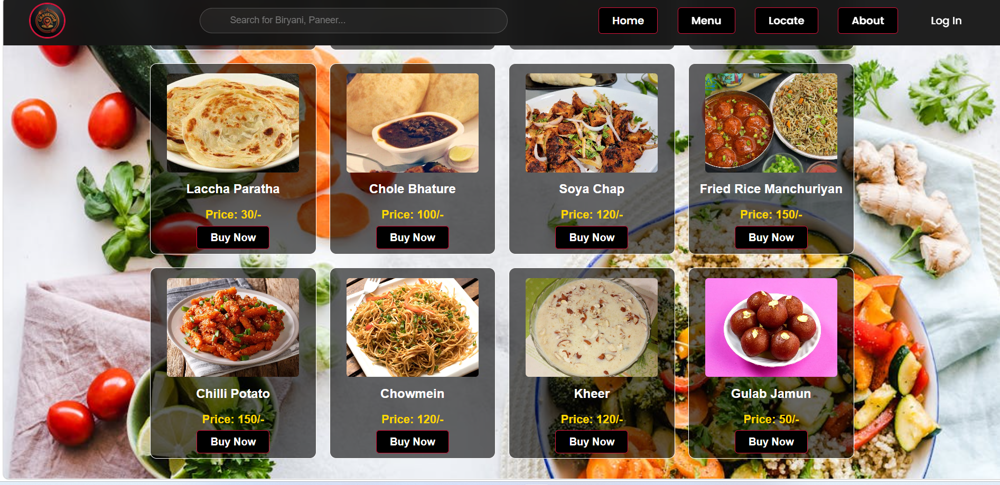

# 🍔 CraveHub - Full-Stack Food Delivery & Restaurant Management System


> A production-ready Java Spring Boot application demonstrating authentication, payment integration, email verification, role-based access control, analytics, and full-stack development best practices.

---

## 📌 Overview

**CraveHub** is a production-ready **Online Food Delivery Platform** and **Restaurant Management System** built using **Java Spring Boot**, **Spring Security**, **Hibernate**, **MySQL**, **Razorpay**, **Google OAuth2**, and **JavaMailSender**.

The platform allows customers to browse menus, place orders, make secure online payments, and track deliveries in real-time. Restaurant administrators can manage inventory, process orders, monitor revenue, and analyze business performance through a powerful analytics dashboard.

---

## 🌟 Highlights

✅ Google OAuth2 Authentication

✅ Email OTP Verification using JavaMailSender

✅ Secure Role-Based Access Control (RBAC)

✅ Razorpay Payment Gateway Integration

✅ Real-Time Order Tracking

✅ Dynamic Menu Management

✅ Inventory Management System

✅ Smart Food Search

✅ Interactive Admin Analytics Dashboard

✅ Responsive User Interface

✅ FoodieBot Customer Assistant

---

## 🎯 Why This Project?

Most beginner projects focus only on CRUD operations.

CraveHub was developed to simulate a real-world enterprise application by integrating:

* OAuth2 Authentication
* SMTP Email Verification
* Payment Gateway Integration
* Role-Based Authorization
* Order Management Workflow
* Business Analytics Dashboard
* Inventory Management System

This project demonstrates practical full-stack development skills commonly used in modern Java enterprise applications.

---

# 📸 Project Screenshots

## 🏠 Home Page & FoodieBot


---

## 🔐 Login Page


---

## 📝 Registration Page


---

## 📧 Email Verification


---

## 📧 CraveHub Email


---

## 🍽️ Menu Page



---

## 🛒 Food Ordering


---

## 💳 Razorpay Checkout


---

## ⏳ Payment Processing


---

## ✅ Payment Successful


---

## 🚚 Order Tracking


---

## 📊 Admin Dashboard Analytics


---

## 📦 Order Management Dashboard


---

## 🏪 Inventory Management


---

# 🛠️ Tech Stack

| Category        | Technologies                       |
| --------------- | ---------------------------------- |
| Backend         | Java 17, Spring Boot 3.1.3         |
| Security        | Spring Security, Google OAuth2     |
| ORM             | Hibernate, Spring Data JPA         |
| Database        | MySQL 8.0                          |
| Frontend        | HTML5, CSS3, JavaScript, Thymeleaf |
| Payment Gateway | Razorpay                           |
| Email Service   | JavaMailSender SMTP                |
| Analytics       | Chart.js                           |
| Build Tool      | Maven                              |
| Version Control | Git & GitHub                       |

---

# 🏗️ System Architecture

```text
User
 │
 ▼
Frontend (HTML/CSS/JS/Thymeleaf)
 │
 ▼
Spring Boot Backend
 │
 ├── Spring Security
 ├── OAuth2 Authentication
 ├── JavaMailSender OTP Service
 ├── Razorpay Payment Service
 ├── Business Analytics Module
 └── Hibernate/JPA
 │
 ▼
MySQL Database
```

---

# 🚀 How To Run The Project

## Step 1: Clone Repository

```bash
git clone https://github.com/Priyanshu7204/CraveHub.git
cd CraveHub
```

---

## Step 2: Configure application.properties

Open:

```text
src/main/resources/application.properties
```

Update the configuration with your own credentials:

```properties
# =========================================
# DATABASE CONFIGURATION
# =========================================

spring.datasource.name=CraveHub
spring.datasource.url=jdbc:mysql://localhost:3306/CraveHub?createDatabaseIfNotExist=true
spring.datasource.username=root
spring.datasource.password=YOUR_DATABASE_PASSWORD

# Hibernate Auto DDL Generation
spring.jpa.hibernate.ddl-auto=update

# =========================================
# GOOGLE OAUTH 2.0 CONFIGURATION
# =========================================

spring.security.oauth2.client.registration.google.client-id=YOUR_GOOGLE_CLIENT_ID
spring.security.oauth2.client.registration.google.client-secret=YOUR_GOOGLE_CLIENT_SECRET

# =========================================
# RAZORPAY PAYMENT GATEWAY
# =========================================

razorpay.key.id=YOUR_RAZORPAY_KEY_ID
razorpay.key.secret=YOUR_RAZORPAY_KEY_SECRET

# =========================================
# EMAIL OTP SETTINGS (JavaMailSender)
# =========================================

spring.mail.host=smtp.gmail.com
spring.mail.port=587
spring.mail.username=YOUR_EMAIL_ADDRESS@gmail.com
spring.mail.password=YOUR_EMAIL_APP_PASSWORD

spring.mail.properties.mail.smtp.auth=true
spring.mail.properties.mail.smtp.starttls.enable=true
```

> **Important:** Use a Gmail App Password instead of your regular Gmail password.

---

## Step 3: Run the Application

### Option A: Using IDE

1. Open the project in IntelliJ IDEA, Eclipse, or VS Code
2. Import as a Maven Project
3. Allow Maven to download all dependencies
4. Run:

```text
CraveHubApplication.java
```

### Option B: Using Maven

```bash
mvn clean install
mvn spring-boot:run
```

---

## Step 4: Create Admin Account

After the application starts successfully for the first time, Spring Boot will automatically create the database and tables.

Run the following SQL query in MySQL:

```sql
USE CraveHub;

INSERT INTO admin
(admin_name, admin_email, admin_password, admin_number)
VALUES
(
'Priyanshu Kumar',
'7204anshu@gmail.com',
'1234',
9955807204
);
```

### Admin Login Credentials

```text
Email    : 7204anshu@gmail.com
Password : 1234
```

---

## Step 5: Access the Application

Open your browser and visit:

```text
http://localhost:8080
```

---

# 🔒 Security Features

* Spring Security Authentication
* Google OAuth2 Login
* Role-Based Access Control (RBAC)
* Email OTP Verification
* Secure Session Management
* Razorpay Payment Verification
* HMAC SHA256 Signature Validation

---

# 📈 Admin Dashboard Features

* Revenue Analytics
* Daily Sales Reports
* Order Statistics
* Top Selling Products
* Inventory Monitoring
* User Management
* Order Processing Workflow

---

# 🚀 Future Enhancements

* JWT Authentication
* REST API Version
* Mobile Application
* Docker Deployment
* Kubernetes Deployment
* AI-Based Food Recommendation System
* Live Delivery Tracking

---

# 🔍 Keywords

**Java Developer • Spring Boot • Spring Security • Hibernate • JPA • MySQL • OAuth2 • Razorpay Integration • JavaMailSender • Maven • Thymeleaf • Full Stack Development • Authentication & Authorization • Role-Based Access Control • Payment Gateway Integration • Food Delivery System • Restaurant Management System • Chart.js Analytics Dashboard**

---

# 👨‍💻 Developers

## Priyanshu Kumar

📧 Email: [7204anshu@gmail.com](mailto:7204anshu@gmail.com)

💼 LinkedIn: https://www.linkedin.com/in/priyanshu7204/

🌐 GitHub: https://github.com/Priyanshu7204

---

## Gagan Tiwari

📧 Email: [tgagan368@gmail.com](mailto:tgagan368@gmail.com)

💼 LinkedIn: https://www.linkedin.com/in/gagan-tiwari-756331245/

🌐 GitHub: https://github.com/TIWARIGAGANS

---

# ⭐ Support

If you found this project helpful, please consider giving it a ⭐ on GitHub!

Your support motivates me to build more real-world projects and contribute to the developer community.

---

# 📄 License

This project is intended for educational, learning, and portfolio purposes.

© 2026 CraveHub. All Rights Reserved.
